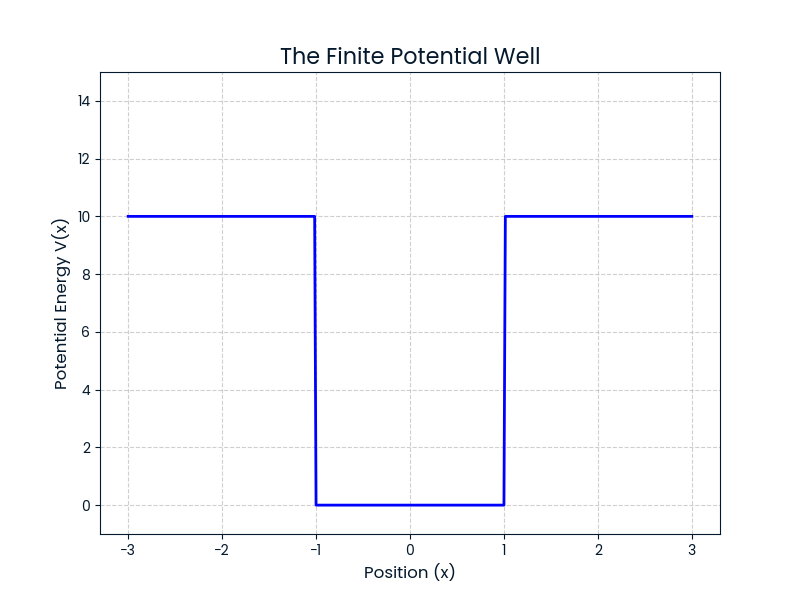

# Week 05: Schrödinger's Wave Equation

**Date of Completion:** September 25, 2025
**Primary Text:** "Quantum Mechanics" by Professor S.M. Moksed Ali.

---

## Summary of Topics Covered

This week's study focused on Chapter 3 of the primary text, which introduces the foundational Schrödinger's Wave Equation and its immediate implications. The key topics included:

*   The concept and development of the wave function (ψ).
*   The physical significance and probabilistic interpretation of the wave function.
*   Derivation of the time-dependent and time-independent Schrödinger equations.
*   Properties of wave functions: Orthogonality, Normalization, and Orthonormality.
*   Calculation of probability current density.
*   The concept of Expectation Values for dynamical variables.
*   Ehrenfest's theorem and the correspondence principle.
*   Solutions for a free particle.
*   Boundary and continuity conditions on the wave function.

---

## Reflections and Challenges

A key challenge was developing a deep intuition for the physical significance of the wave function, ψ, beyond its mathematical definition. While the formalism is accessible, grasping its probabilistic nature and the conditions for normalization required significant review and problem-solving. This leads to further questions regarding the measurement problem, which I look forward to exploring in more advanced texts.

---

## Artifacts

### Computational Project: Visualizing a Potential Well

As a first step in applying computational methods to quantum mechanics, I have written a Python script to visualize the potential energy function, V(x), for a finite square well. This demonstrates the fundamental environment in which a quantum particle's behavior is studied.

**The Potential V(x):**

**Code:**
*   [Link to Python Script](./computational_artifact/plot_potential.py)
